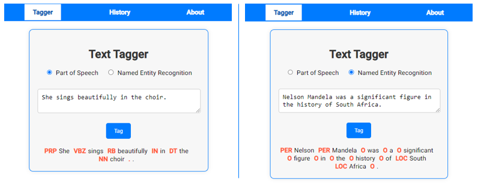
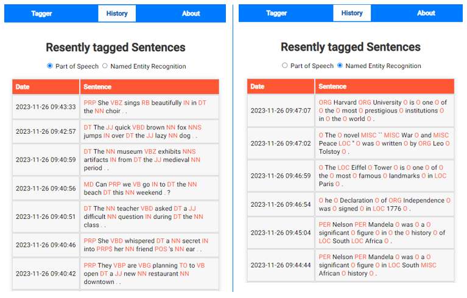
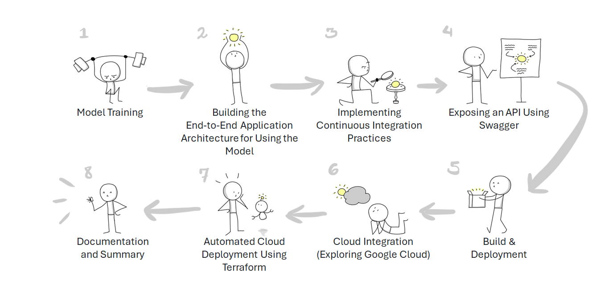
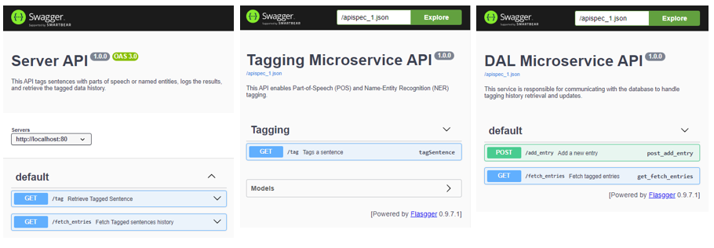
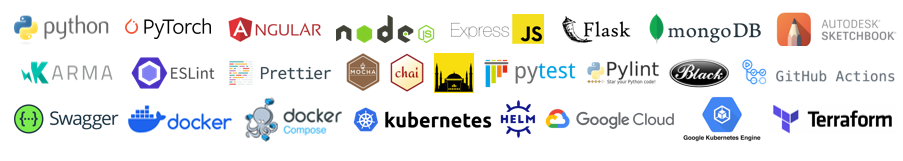

     

## Project Overview

This project provides a practical learning experience in deploying and launching machine learning applications. While the core component is a machine learning model, the project's goal is to impart real-world knowledge and best practices in **building and automating software projects**.

The application is composed of 4 microservices:

* **dal:** A Data Access Layer.
* **tagger:** Part-of-speech (POS) and named-entities recognition (NER) tagger.
* **server:** Node server that communicates with the client.
* **frontend:** Angular client.

## Project Stages

The stages are outlined in the following roadmap:

and now, in more details:

1. **Model Training:** The selected model is a text model for POS and NER tagging. Additional details about the model can be found in the [tagging component directory](https://github.com/mhornstein/DK-NLP/tree/main/tagger).
    * **Technologies:** Pytorch
    * **Main Learning Source:**
        * [Deep Learning Methods for Texts and Sequences](https://shoham.biu.ac.il/BiuCoursesViewer/CourseDetails.aspx?lid=748157) course at Bar Ilan University.

2. **Building the End-to-End Application Architecture for Using the Model:** The architecture includes a client-side Angular application, a Node.js server, a Flask microservice exposing the tagging model, and a MongoDB database exposed via a DAL microservice.
    * **Technologies:**
        * Client: Angular
        * Server: Node.js, Express
        * Microservices: Flask
        * Database: MongoDB
    * **Main Learning Source:**
        * [Full Stack Web Development with Angular Specialization](https://www.coursera.org/specializations/full-stack-mobile-app-development)

3. **Implementing Continuous Integration Practices:** Establishing a cycle of testing, linting, and code formatting for every code change.
    * **CI/CD platform:** GitHub Actions
    * **Client Technologies**:
        * Testing: Karma
        * Linting: ESLint
        * Formatting: Prettier
    * **Server Technologies**:
        * Testing: Chai, Mocha, Istanbul
        * Linting and Formatting: ESLint
    * **Microservice Technologies**:
        * Testing: unittest, Pytest
        * Linting: pylint
        * Formatting: Black
    * **Code Coverage**: Each component's coverage is tested separately using its designated technology. Subsequently, the "Coverage CI" workflow consistently recalculates and refreshes the overall project's code coverage. This mechanism guarantees that the coverage badge displayed at the top of this README, along with the [Codecov Dashboard](https://app.codecov.io/gh/mhornstein/DK-NLP), is kept up-to-date following each new commit.
    * **Main Learning Sources:**
        * [Cloud Computing Foundations course](https://www.coursera.org/account/accomplishments/certificate/CH4FFC84RHL5)
        * [Angular Unit Testing Made Easy video serie](https://www.youtube.com/watch?v=emnwsVy8wRs)

4. **Exposing an API Using Swagger:** Enabling API exposure for the server and the dal and tagger microservices.

5. **Build and Deployment:** Enabling various options for building and deploying the app, with a focus on the Docker and Kubernetes ecosystem.
    * **Technologies:**
        * Dockers
        * Docker compose
        * Kubernetes
        * Helm
    * **Main Learning Sources:**
        * [Kubernetes Essential by IBM video serie](https://www.youtube.com/watch?v=2vMEQ5zs1ko&list=PLOspHqNVtKABAVX4azqPIu6UfsPzSu2YN)    
        * [Docker Containers and Kubernetes Fundamentals - Full Hands-On Course](https://www.youtube.com/watch?v=kTp5xUtcalw&t=40s)
        * [Cloud Virtualization, Containers and APIs course](https://coursera.org/share/2d0cde0956bd64bdaaff9f7fba05dbde)

6. **Cloud Integration (Exploring Google Cloud):** Having previously worked with AWS, I decided to broaden my experience by exploring another cloud provider, Google Cloud. My goal was to leverage Kubernetes and Helm for orchestrating and managing microservices, rather than deploying them on virtual machines. 
    * **Technologies:** Google Kubernetes Engine (GKE).
    * **Main Learning Sources:**
        * [Creating a GKE cluster (demo)](https://www.youtube.com/watch?v=hxpGC19PzwI)
        * [How to deploy applications to Google Kubernetes Engine via Helm (tutorial)](https://www.youtube.com/watch?v=1ozU69f8OSA&t=480s)
     
7. **Automated Cloud Deployment Using Terraform:** This phase focuses on deploying the application to Google Kubernetes Engine (GKE) using Terraform in conjunction with Helm, building upon the Helm charts established in step 5.
    * **Technologies:** Terraform.
    * **Main Learning Sources:**
        As there wasn't a single comprehensive course for this segment, I relied on a variety of resources, including:
        * [Full Tutorial: Deploying Helm Charts in Kubernetes with Terraform](https://www.youtube.com/watch?v=Qq1cfVw1Mx4)
        * [This Github Repository](https://github.com/mr-pascal/medium-tf-gke-helm/tree/main)

8. **Documentation and Summary**: During the project, I consistently documented the progress and the completed tasks. This documentation is important for two reasons. First, it helped in capturing the learning journey, ensuring that every new skill and piece of knowledge was noted down. Second, it provides a clear and organized summary of how the application was set up and developed, making it easier for anyone to understand how to deploy and run it (in any of the deployment options avaiable). In this final stage, I reviewed the documentation. Additionally, I wanted to include a visual representation of the journey I made that will be presented both in this README file and in the app "about" page. To achieve this, I **manually illustrated** the project's roadmap (which, as mentioned, you can find at the start of this README).
    * **Tools:** Autodesk Sketchbook, Wacom tablet.
    * **Main Learning Sources:** [Sketchnoting: Communicate with Visual Notes (Domestika course)](https://www.domestika.org/en/courses/4382-sketchnoting-communicate-with-visual-notes/course)

## Technologies and Tools summary

Here is a visual summary of all the technologies and tools that I met and used along the way:

## Future Aspiration

This repository is continuously updated as my learning journey progresses. Currently, as a broad guideline, my next objectives include:
* Continuous Delivery via GitHub Actions - exploring the possibility of maintaining an always-updated, live version of the app that updates with every push.
* Completing the "About" page for the application.
* Exploring logging mechanisms.
* Conducting stress tests.
* Exploring Dashboards and monitoring tools.

## What Would I Do Differently?

* Reverse the steps and start with the CI process first, followed by Building the Applicable architecture for Using the Model simultaneously, as this approach aligns better with development practices and allows for continuous integration from the beginning. The order I used was chosen for educational purposes, enabling tool-specific learning at each stage.

